# Matriz formal de dependência — v2

> **Changelog v2:** adição do artefato `14 nfr`; resolução da circularidade `05 ↔ 06`; reclassificação de `12 adrs` como artefato iterativo/contínuo; correção da ordem de produção; correção do grafo; ajuste da recomendação frontend-first.

---

## Matriz formal de dependência

| ID   | Documento               | Upstream obrigatório               | Downstream principal            | Dependência                 | Pode evoluir em paralelo?                         | Observação                                                                                                      |
| ---- | ----------------------- | ---------------------------------- | ------------------------------- | --------------------------- | ------------------------------------------------- | --------------------------------------------------------------------------------------------------------------- |
| 01   | **briefing**            | —                                  | 02, 03, 04                      | fundacional                 | não faz sentido                                   | ponto de partida do problema e contexto                                                                         |
| 02   | **hypotheses**          | 01                                 | 04, 05, 06, 12                  | exploratória                | sim, com 03                                       | ajuda a preencher o vazio inicial, mas não deve governar a execução final                                       |
| 03   | **gaps**                | 01                                 | 04, 05, 06, 07, 08, 12, 13      | exploratória                | sim, com 02                                       | delimita o que ainda precisa ser decidido                                                                       |
| 04   | **prd**                 | 01, 02, 03                         | 05, 06, 07, 08, 12, 13, 14      | central/mandatória          | não, é o pivô                                     | consolida visão, objetivos, personas e escopo do produto                                                        |
| 05   | **functional-spec**     | 04                                 | 06, 07, 08, 09, 10, 11, 13      | mandatória                  | sim, co-evolui com 06 e 08; 05 é a fonte principal | traduz o PRD em comportamento funcional do sistema; 06 refina restrições sobre 05, não o contrário              |
| 06   | **business-rules**      | 04                                 | 07, 09, 10, 11, 13              | mandatória                  | sim, co-evolui com 05; refinamento de restrições  | fixa restrições, validações e regras operacionais; lê 05 como referência, não como pré-requisito bloqueante     |
| 07   | **acceptance-criteria** | 04, 05, 06, 08                     | 13                              | validação                   | sim, após 05/06/08 estarem estáveis               | define o que prova que a entrega está correta                                                                   |
| 08   | **ux-spec**             | 04, 05                             | 07, 09, 11, 13                  | mandatória para experiência | sim, com 06; após 05 ter estrutura mínima         | amarra fluxo visível, telas e jornada do usuário                                                                |
| 09   | **api-contracts**       | 05, 06, 08, 11, 12, 14             | 13                              | técnica derivada            | parcialmente, com 10                              | contrato técnico dos fluxos já decididos; NFRs definem SLAs, limites de payload e requisitos de segurança       |
| 10   | **data-model**          | 05, 06, 11, 12, 14                 | 09, 13                          | técnica derivada            | parcialmente, com 09                              | estrutura persistência e entidades do domínio; NFRs definem requisitos de retenção, criptografia e performance  |
| 11   | **auth-matrix**         | 05, 06, 08                         | 09, 10, 13                      | técnica/segurança           | sim, logo após 05/06 estabilizarem                | define permissões por papel e impacta API e dados                                                               |
| 12   | **adrs**                | 04 (inicial); contínuo até 09/10   | 09, 10, 13                      | arquitetural/iterativa      | **sim, é contínuo** — não tem posição fixa        | registra decisões estruturais no momento em que ocorrem; segue padrão MADR/RFC; emerge desde 04 até realização técnica |
| 13   | **test-plan**           | 04, 05, 06, 07, 08, 09, 11, 12, 14 | execução de testes              | terminal                    | parcialmente — ver nota                           | consolida como validar funcional, integração, contrato, E2E e não-funcional; testes de contrato podem iniciar com 09 |
| 14   | **nfr**                 | 04                                 | 09, 10, 13                      | mandatória técnica          | sim, com 05 e 06                                  | **artefato novo:** cobre performance, disponibilidade, segurança e compliance; sem ele, 09 e 10 ficam sem SLAs e requisitos de criptografia |

---

## Classificação por camada

### 1. Descoberta

- 01 briefing
- 02 hypotheses
- 03 gaps

Servem para sair do problema bruto para um escopo minimamente definido.

### 2. Definição de produto

- 04 prd

É o documento mais central do conjunto. Sem ele, os demais ficam sem prioridade clara.

### 3. Especificação

- 05 functional-spec
- 06 business-rules
- 08 ux-spec
- 14 nfr
- 12 adrs *(contínuo — emerge ao longo desta camada e da seguinte)*

`05` e `06` co-evoluem em iteração controlada: `05` é a fonte principal de comportamento funcional, `06` refina restrições e validações sobre o que `05` define. A relação é bidirecional com precedência de `05`, não uma dependência sequencial bloqueante. `14 nfr` deve ser produzido nesta camada para que os artefatos técnicos tenham requisitos não-funcionais claros antes de serem escritos.

### 4. Realização técnica

- 11 auth-matrix
- 10 data-model
- 09 api-contracts

Materializa o comportamento em contrato, persistência e autorização. `11` deve preceder `09` e `10`, pois permissões afetam operações e visibilidade de dados.

### 5. Validação

- 07 acceptance-criteria
- 13 test-plan

Define como provar que o que foi construído atende ao esperado. Testes de contrato (contract testing) podem ser iniciados em paralelo com `09`, sem esperar `13` estar completo.

---

## Nota sobre ADRs (12)

ADRs seguem o padrão MADR (*Markdown Architectural Decision Records*) e o modelo RFC. **Não são produzidos em uma fase única** — emergem no momento em que uma decisão estrutural relevante é tomada, desde a estabilização do PRD até a realização técnica. Tratá-los como documento sequencial introduz risco de perda de rastreabilidade de decisões tomadas no meio do processo.

Recomendação: manter um backlog ativo de ADRs desde a fase de especificação, com revisão obrigatória antes de fechar `09` e `10`.

---

## Dependências críticas

- **04 PRD** é dependência crítica de quase tudo.
- **05 functional-spec** e **06 business-rules** são dependências críticas de API, modelo de dados, autorização e testes — co-evoluem, com `05` como fonte principal.
- **14 NFR** é dependência crítica de `09` e `10`: sem SLAs e requisitos não-funcionais, contratos de API e modelo de dados ficam incompletos.
- **08 UX spec** é crítica para critérios de aceite e para partes do contrato ligadas a fluxo de usuário.
- **11 auth-matrix** é crítica para API e modelo de dados, porque permissões afetam operações e visibilidade.
- **07 acceptance-criteria** é crítica para um test plan realmente verificável.

---

## Paralelismo recomendado

Pode rodar em paralelo, com baixo risco:

- **02 hypotheses** + **03 gaps**
- **05 functional-spec** + **06 business-rules** + **14 nfr** *(co-evolução controlada)*
- **08 ux-spec** evoluindo junto de 05/06, após 05 ter estrutura mínima
- **09 api-contracts** + **10 data-model**, depois que 05/06/11/12/14 estiverem maduros
- **12 adrs** em trilha paralela contínua desde 04

Não é bom rodar em paralelo cedo demais:

- **04 PRD** com **09 API**
- **04 PRD** com **10 data model**
- **07 acceptance-criteria** antes de 05/06/08 estabilizarem
- **13 test-plan** antes de 07 existir
- **11 auth-matrix** antes de 05/06 terem comportamento funcional mínimo definido

---

## Ordem ideal de produção

```
1.  01 briefing
2.  02 hypotheses + 03 gaps          ← paralelo
3.  04 prd
4.  05 functional-spec
    06 business-rules                ← co-evolução com 05
    14 nfr                           ← paralelo com 05/06
5.  08 ux-spec                       ← após 05 ter estrutura mínima
    12 adrs                          ← trilha contínua desde o passo 3
6.  11 auth-matrix
7.  10 data-model + 09 api-contracts ← paralelo, após 11
8.  07 acceptance-criteria
9.  13 test-plan
```

---

## Grafo de dependências

```text
01 -> 02, 03, 04
02, 03 -> 04
04 -> 05, 06, 08, 12, 14
05 <-> 06                         (co-evolução; 05 tem precedência)
05, 06 -> 08
05, 06, 08 -> 07
05, 06, 08 -> 11
05, 06, 11, 12, 14 -> 10
05, 06, 08, 11, 12, 14 -> 09
10 -> 09
04, 05, 06, 07, 08, 09, 11, 12, 14 -> 13
12 -> contínuo (04..09)
14 -> 09, 10, 13
```

---

## Recomendação prática

### Abordagem frontend-first

Para times que desenvolvem começando pelo frontend, a cadeia principal é:

```
04 PRD
  → 05 Functional Spec + 06 Business Rules (co-evolução)
  → 14 NFR (paralelo)
  → 08 UX Spec
  → 11 Auth Matrix
  → 09 API Contracts + 10 Data Model (paralelo)
  → 07 Acceptance Criteria
  → 13 Test Plan
```

Com `12 ADRs` como trilha paralela contínua registrando decisões estruturais ao longo de todo o processo.

Assim o frontend nasce a partir de fluxo e tela (05 + 08), o backend respeita contratos derivados desses fluxos (09 + 10), e os requisitos não-funcionais (14) garantem que API e modelo de dados já nascem com SLAs, limites e requisitos de segurança definidos.

### Abordagem backend-first / API-first

Para times que partem da API, a cadeia prioritária é:

```
04 PRD
  → 05 Functional Spec + 06 Business Rules + 14 NFR
  → 11 Auth Matrix
  → 10 Data Model
  → 09 API Contracts
  → 08 UX Spec (consome os contratos já definidos)
  → 07 Acceptance Criteria
  → 13 Test Plan
```


A produção é incremental e orientada por gates de qualidade — o planner não despeja tudo de uma vez, ele libera trabalho na medida em que os upstream estão estáveis o suficiente para o downstream começar.

O ponto central é que o planner nunca libera trabalho em cascata total — ele é orientado por gates. Cada gate é uma decisão explícita de "esse conjunto de artefatos está estável o suficiente para o próximo bloco começar". Sem isso, o executor produz coisas que depois precisam ser reescritas por mudança de upstream.

**O papel de cada agente ao longo do tempo:**

O planner tem duas responsabilidades distintas dependendo do momento. Nas fases iniciais (sprints 1–2), ele é basicamente um decompositor de problema — pega o briefing bruto e transforma em tasks executáveis. A partir do sprint 3, ele muda de modo: passa a ser um gerenciador de dependências, verificando continuamente o que ficou estável o suficiente para liberar o próximo downstream. É ele quem segura o executor de tentar fazer `09 api-contracts` antes de `11 auth-matrix` estar fechada.

O executor é o único que realmente produz artefatos, mas ele nunca produz sem contexto. O planner sempre passa junto a lista dos upstream já aprovados que o executor deve usar como insumo. No sprint 3, por exemplo, o executor recebe `05`, `06` e `14` como co-evolução — o planner precisa deixar explícito que `05` é a fonte principal e `06` refina, não bloqueia.

O revisor não é apenas um aprovador de qualidade textual — ele valida consistência entre artefatos. No sprint 5, por exemplo, ele cruza `11 auth-matrix` com `09 api-contracts` para verificar se as permissões definidas realmente estão refletidas nas operações expostas. No sprint 6, ele cruza `07 acceptance-criteria` com `13 test-plan` para garantir que cada critério tem ao menos um caso de teste associado.

**Os dois artefatos com comportamento especial:**

`12 ADRs` é o único que não tem sprint fixo — o executor registra cada decisão estrutural no momento em que ela é tomada, e o planner mantém um backlog ativo de decisões pendentes. O revisor os lê em bloco no sprint 5, antes de fechar os contratos técnicos.

`06 business-rules` co-evolui com `05` no sprint 3, mas há uma regra de precedência que o planner precisa comunicar ao executor: se há conflito entre o que `05` define como comportamento e o que `06` quer restringir, `05` ganha. `06` só pode adicionar restrições sobre comportamentos que `05` já definiu — ele não cria comportamento novo.

# Time agêntico — sprints e artefatos

```mermaid
gantt
    title Produção de artefatos por sprint — time agêntico (planner · executor · revisor)
    dateFormat  X
    axisFormat  Sprint %s

    section Sprint 1 · Descoberta
    [planner] 01 briefing              :done,    s1p1, 0, 1
    [executor] 02 hypotheses           :active,  s1e1, 1, 2
    [executor] 03 gaps                 :active,  s1e2, 1, 2
    [revisor]  02 + 03                 :         s1r1, 2, 3
    GATE 1 — briefing + hipóteses + gaps :crit,  g1,   3, 3

    section Sprint 2 · Definição
    [planner] consolida 01+02+03       :done,    s2p1, 3, 4
    [executor] 04 prd                  :active,  s2e1, 4, 5
    [revisor]  04 prd                  :         s2r1, 5, 6
    GATE 2 — PRD aprovado (pivô)       :crit,    g2,   6, 6

    section Sprint 3 · Especificação
    [planner] decompõe PRD             :done,    s3p1, 6, 7
    [executor] 05 func-spec            :active,  s3e1, 7, 8
    [executor] 06 biz-rules (co-evol.) :active,  s3e2, 7, 8
    [executor] 14 nfr                  :active,  s3e3, 7, 8
    [executor] 12 adrs (contínuo)      :active,  s3e4, 7, 8
    [revisor]  05 + 06 + 14            :         s3r1, 8, 9
    GATE 3 — func-spec + biz-rules + NFR :crit,  g3,   9, 9

    section Sprint 4 · Experiência
    [planner] agenda UX com base em 05 :done,    s4p1, 9, 10
    [executor] 08 ux-spec              :active,  s4e1, 10, 11
    [executor] 12 adrs (contínuo)      :active,  s4e2, 10, 11
    [revisor]  08 ux-spec              :         s4r1, 11, 12
    GATE 4 — UX-spec alinhada          :crit,    g4,   12, 12

    section Sprint 5 · Realização técnica
    [planner] agenda 11 antes de 09/10 :done,    s5p1, 12, 13
    [executor] 11 auth-matrix          :active,  s5e1, 13, 14
    [executor] 10 data-model           :active,  s5e2, 14, 15
    [executor] 09 api-contracts        :active,  s5e3, 14, 15
    [revisor]  11 + 10 + 09 + 12 adrs :         s5r1, 15, 16
    GATE 5 — contratos técnicos + ADRs :crit,    g5,   16, 16

    section Sprint 6 · Validação
    [planner] agenda 07 antes de 13    :done,    s6p1, 16, 17
    [executor] 07 accept. criteria     :active,  s6e1, 17, 18
    [revisor]  07 accept. criteria     :         s6r1, 18, 19
    [executor] 13 test-plan            :active,  s6e2, 19, 20
    [revisor]  13 test-plan            :         s6r2, 20, 21
    GATE 6 — test-plan aprovado        :crit,    g6,   21, 21
```



---

## Legenda

| Estilo              | Agente / tipo                           |
| ------------------- | --------------------------------------- |
| `done` (cinza)      | planner — decompõe e agenda             |
| `active` (azul)     | executor — produz o artefato            |
| sem estilo (branco) | revisor — valida e aprova               |
| `crit` (vermelho)   | gate — bloqueante para o próximo sprint |

---

## Regras de gate

| Gate   | Condição de passagem                                         |
| ------ | ------------------------------------------------------------ |
| Gate 1 | briefing, hypotheses e gaps aprovados pelo revisor           |
| Gate 2 | PRD aprovado — sem ele nenhum downstream começa              |
| Gate 3 | func-spec, biz-rules e NFR consistentes entre si             |
| Gate 4 | UX-spec alinhada com func-spec e biz-rules                   |
| Gate 5 | auth-matrix, data-model e api-contracts aprovados; ADRs fechados |
| Gate 6 | test-plan aprovado com cobertura: funcional, contrato, E2E e NFR |

---

## Notas de co-evolução e comportamento especial

- **05 func-spec ↔ 06 biz-rules**: co-evoluem no sprint 3. `05` é a fonte principal de comportamento; `06` apenas restringe — nunca cria comportamento novo. Em caso de conflito, `05` tem precedência.
- **12 adrs**: único artefato sem sprint fixo. O executor registra cada decisão estrutural no momento em que ocorre (sprints 3–5). O revisor os valida em bloco no gate 5, antes de fechar os contratos técnicos.
- **07 accept. criteria → 13 test-plan**: sequencial dentro do sprint 6. O planner só libera o test-plan após o revisor aprovar os critérios de aceite.
- **10 data-model ∥ 09 api-contracts**: paralelos, mas após `11 auth-matrix` estar fechada. Permissões afetam operações (API) e visibilidade de dados (modelo).
