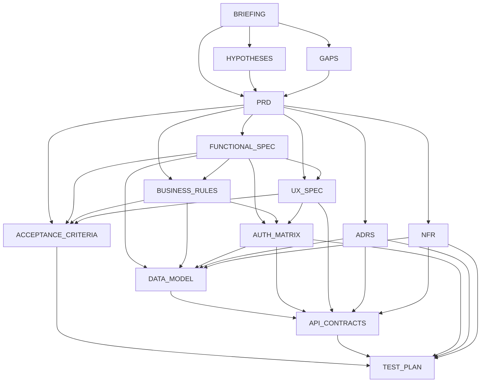

# SDLC Discovery v2 — DAG-Based Sprint Orchestration

> **For agentic workers:** REQUIRED SUB-SKILL: Use superpowers:subagent-driven-development (recommended) or superpowers:executing-plans to implement this plan task-by-task. Steps use checkbox (`- [ ]`) syntax for tracking.

**Goal:** Upgrade the SDLC discovery pipeline from sequential 13-artifact generation to a 14-artifact DAG-based system with 6 sprints, quality gates, and a reviewer agent that validates cross-artifact consistency.

**Architecture:** The current `DiscoveryHarness` loops over `ARTIFACT_ORDER` sequentially. We replace this with a sprint-based DAG scheduler that: (1) defines 6 sprints with explicit artifact sets and dependency edges, (2) uses `graphlib.TopologicalSorter` within each sprint to determine parallel-ready tasks, (3) runs artifacts within a sprint concurrently via `asyncio.gather`, (4) validates gate conditions between sprints via a reviewer LLM call, and (5) adds the new `NFR` artifact type throughout. The harness retains backward compatibility — `maestro discover` CLI entry point stays the same.

**Tech Stack:** Python 3.12, asyncio, graphlib.TopologicalSorter (stdlib), existing providers/httpx, Pydantic dataclasses for sprint/gate models.

**Source of Truth:** All sprint definitions and dependency edges in this plan derive from `docs/Matriz_formal_de_dependência_v2.md`. Any discrepancy between plan and matrix is a bug in the plan; matrix wins.

**Out of Scope:**
- Replacing sequential mode as default — `--sprints` is opt-in; default `maestro discover` keeps sequential behavior.
- Multi-project / cross-repo orchestration.
- Persisting sprint state across invocations (each run is fresh).
- Gate failure remediation loops (auto-retry, human-in-the-loop). Gate failures are warned but do not halt; a follow-up plan will add `--strict-gates`.
- ADR continuous emission across sprints 3–5 (modeled as single sprint-3 artifact for v2; future iteration adds backlog mode).
- Editing the existing reflect loop algorithm (only DIMENSIONS list grows by one).

## DAG Overview



---

## File Structure

| Action | File | Responsibility |
|--------|------|----------------|
| Modify | `maestro/sdlc/schemas.py` | Add `NFR` to `ArtifactType`, `ARTIFACT_FILENAMES`, `ARTIFACT_ORDER`; add `SprintDef`, `GateResult`, `SprintResult` dataclasses |
| Modify | `maestro/sdlc/prompts.py` | Add NFR system prompt to `PROMPTS` dict |
| Create | `maestro/sdlc/sprints.py` | Sprint DAG definition: 6 sprints, dependency edges, `SPRINTS` list, `get_ready_artifacts()` function |
| Create | `maestro/sdlc/reviewer.py` | Reviewer agent: LLM-based gate validation between sprints, cross-artifact consistency checks |
| Modify | `maestro/sdlc/harness.py` | Replace sequential loop with sprint-based DAG execution; integrate reviewer gates |
| Modify | `maestro/sdlc/generators.py` | No code changes needed — already works per-artifact |
| Modify | `maestro/sdlc/reflect.py` | Update DIMENSIONS to include NFR-related checks |
| Modify | `tests/test_sdlc_schemas.py` | Update 13→14 assertions, add sprint/gate dataclass tests |
| Modify | `tests/test_sdlc_generators.py` | Update 13→14 assertions |
| Modify | `tests/test_sdlc_harness.py` | Update 13→14 assertions, add sprint-based execution tests, gate tests |
| Modify | `tests/test_sdlc_writer.py` | Update 13→14 assertions |
| Create | `tests/test_sdlc_sprints.py` | Tests for sprint DAG topology, parallel groups, cycle detection |
| Create | `tests/test_sdlc_reviewer.py` | Tests for reviewer gate validation |

---

### Task 1: Add NFR Artifact Type to Schemas

**Files:**
- Modify: `maestro/sdlc/schemas.py:9-57`
- Test: `tests/test_sdlc_schemas.py`

- [ ] **Step 1: Write the failing test**

Update `tests/test_sdlc_schemas.py` — change `test_artifact_type_has_13_members` to expect 14, and update `test_artifact_filenames_numbered_01_to_13` to expect 1-14:

```python
def test_artifact_type_has_14_members() -> None:
    assert len(ArtifactType) == 14


def test_artifact_filenames_numbered_01_to_14() -> None:
    numbers = sorted(
        int(v.split("-")[0]) for v in ARTIFACT_FILENAMES.values()
    )
    assert numbers == list(range(1, 15))
```

Also update `test_discovery_result_artifact_count` to expect 14:

```python
def test_discovery_result_artifact_count() -> None:
    req = SDLCRequest("Build X")
    arts = [
        SDLCArtifact(t, ARTIFACT_FILENAMES[t], "content")
        for t in ArtifactType
    ]
    result = DiscoveryResult(request=req, artifacts=arts, spec_dir="/tmp/spec")
    assert result.artifact_count == 14
```

- [ ] **Step 2: Run tests to verify they fail**

Run: `pytest tests/test_sdlc_schemas.py -v`
Expected: 3 failures (14 members, 01-14, artifact count)

- [ ] **Step 3: Add NFR enum value and mappings**

In `maestro/sdlc/schemas.py`, add `NFR` to the `ArtifactType` enum after `TEST_PLAN`:

```python
    TEST_PLAN = "test_plan"
    NFR = "nfr"
```

Add the filename mapping to `ARTIFACT_FILENAMES`:

```python
    ArtifactType.TEST_PLAN: "13-test-plan.md",
    ArtifactType.NFR: "14-nfr.md",
```

Add `NFR` to `ARTIFACT_ORDER` at the end (slot 14) so the order matches the `ARTIFACT_FILENAMES` numeric prefixes. This list is the *file/sequential* order used by the legacy non-sprint harness; sprint mode uses `sprints.py` for the true dependency order (where NFR is produced in sprint 3):

```python
ARTIFACT_ORDER: list[ArtifactType] = [
    ArtifactType.BRIEFING,
    ArtifactType.HYPOTHESES,
    ArtifactType.GAPS,
    ArtifactType.PRD,
    ArtifactType.FUNCTIONAL_SPEC,
    ArtifactType.BUSINESS_RULES,
    ArtifactType.ACCEPTANCE_CRITERIA,
    ArtifactType.UX_SPEC,
    ArtifactType.API_CONTRACTS,
    ArtifactType.DATA_MODEL,
    ArtifactType.AUTH_MATRIX,
    ArtifactType.ADRS,
    ArtifactType.TEST_PLAN,
    ArtifactType.NFR,
]
```

Also update the docstring at line 10 from `"""The 13 SDLC artifact types"""` to `"""The 14 SDLC artifact types"""`.

- [ ] **Step 3b: Verify length invariant**

Add to `tests/test_sdlc_schemas.py`:

```python
def test_artifact_filenames_and_order_have_same_size() -> None:
    assert len(ARTIFACT_FILENAMES) == len(ArtifactType) == len(ARTIFACT_ORDER) == 14
```

This guards against future drift (e.g., adding an enum value but forgetting the filename mapping).

- [ ] **Step 4: Run tests to verify they pass**

Run: `pytest tests/test_sdlc_schemas.py -v`
Expected: ALL PASS

- [ ] **Step 5: Commit**

```bash
git add maestro/sdlc/schemas.py tests/test_sdlc_schemas.py
git commit -m "feat(sdlc): add NFR artifact type (14th artifact)"
```

---

### Task 2: Add NFR System Prompt

**Files:**
- Modify: `maestro/sdlc/prompts.py:87-92`
- Test: `tests/test_sdlc_generators.py:145-147`

- [ ] **Step 1: Write the failing test**

Update `test_prompts_cover_all_artifact_types` to expect 14 prompts:

```python
def test_prompts_cover_all_artifact_types() -> None:
    assert len(PROMPTS) == 14
    missing = set(ArtifactType) - set(PROMPTS)
    assert not missing, f"Missing prompts for: {missing}"
```

- [ ] **Step 2: Run test to verify it fails**

Run: `pytest tests/test_sdlc_generators.py::test_prompts_cover_all_artifact_types -v`
Expected: FAIL — `len(PROMPTS) == 13`

- [ ] **Step 3: Add NFR prompt to PROMPTS dict**

In `maestro/sdlc/prompts.py`, add after the `TEST_PLAN` entry:

```python
    ArtifactType.NFR: (
        "You are a senior performance and reliability engineer. "
        "Write the Non-Functional Requirements (NFR) document: performance targets, "
        "availability SLAs, scalability constraints, security requirements, "
        "compliance obligations, and operational thresholds. "
        "Include measurable criteria for each requirement. "
        + _BASE_RESOLVED
    ),
```

- [ ] **Step 4: Run test to verify it passes**

Run: `pytest tests/test_sdlc_generators.py::test_prompts_cover_all_artifact_types -v`
Expected: PASS

- [ ] **Step 5: Commit**

```bash
git add maestro/sdlc/prompts.py tests/test_sdlc_generators.py
git commit -m "feat(sdlc): add NFR system prompt"
```

---

### Task 3: Fix Hardcoded 13→14 in All Existing Tests

**Files:**
- Modify: `tests/test_sdlc_harness.py`
- Modify: `tests/test_sdlc_generators.py`
- Modify: `tests/test_sdlc_writer.py`

- [ ] **Step 1: Update harness tests**

In `tests/test_sdlc_harness.py`, update all `13` references to `14`:

- `test_harness_run_produces_13_artifacts` → rename to `test_harness_run_produces_14_artifacts`, assert `result.artifact_count == 14`
- `test_harness_writes_13_files` → rename to `test_harness_writes_14_files`, assert `len(written) == 14`
- `test_harness_writes_each_artifact_incrementally`: assert `len(written_counts) == 14`
- `test_harness_with_provider_calls_generators` in `tests/test_sdlc_generators.py`: assert `len(provider.calls) == 14` and `result.artifact_count == 14`

- [ ] **Step 2: Update writer tests**

In `tests/test_sdlc_writer.py`:

- `test_write_artifacts_writes_all_files`: assert `len(written) == 14`

- [ ] **Step 3: Run all SDLC tests**

Run: `pytest tests/test_sdlc_*.py -v`
Expected: ALL PASS (14 artifacts, all existing tests pass)

- [ ] **Step 4: Commit**

```bash
git add tests/test_sdlc_harness.py tests/test_sdlc_generators.py tests/test_sdlc_writer.py
git commit -m "test(sdlc): update all tests for 14-artifact system"
```

---

### Task 4: Create Sprint DAG Definition Module

**Files:**
- Create: `maestro/sdlc/sprints.py`
- Create: `tests/test_sdlc_sprints.py`

- [ ] **Step 1: Write the sprint definition module**

Create `maestro/sdlc/sprints.py`:

```python
"""SDLC Sprint DAG — 6 sprints with dependency edges and parallel groups."""
from __future__ import annotations

from dataclasses import dataclass, field

from graphlib import TopologicalSorter

from maestro.sdlc.schemas import ArtifactType


@dataclass(frozen=True)
class SprintDef:
    """Definition of a single sprint in the SDLC pipeline."""

    sprint_id: int
    name: str
    artifacts: tuple[ArtifactType, ...]
    deps: dict[ArtifactType, tuple[ArtifactType, ...]]
    description: str = ""


SPRINTS: list[SprintDef] = [
    SprintDef(
        sprint_id=1,
        name="Descoberta",
        artifacts=(
            ArtifactType.BRIEFING,
            ArtifactType.HYPOTHESES,
            ArtifactType.GAPS,
        ),
        deps={
            ArtifactType.BRIEFING: (),
            ArtifactType.HYPOTHESES: (ArtifactType.BRIEFING,),
            ArtifactType.GAPS: (ArtifactType.BRIEFING,),
        },
        description="Discovery: briefing, hypotheses, and gaps",
    ),
    SprintDef(
        sprint_id=2,
        name="Definicao",
        artifacts=(
            ArtifactType.PRD,
        ),
        deps={
            ArtifactType.PRD: (ArtifactType.BRIEFING, ArtifactType.HYPOTHESES, ArtifactType.GAPS),
        },
        description="Product definition: PRD",
    ),
    SprintDef(
        sprint_id=3,
        name="Especificacao",
        artifacts=(
            ArtifactType.FUNCTIONAL_SPEC,
            ArtifactType.BUSINESS_RULES,
            ArtifactType.NFR,
            ArtifactType.ADRS,
        ),
        deps={
            ArtifactType.FUNCTIONAL_SPEC: (ArtifactType.PRD,),
            ArtifactType.BUSINESS_RULES: (ArtifactType.PRD, ArtifactType.FUNCTIONAL_SPEC),
            ArtifactType.NFR: (ArtifactType.PRD,),
            ArtifactType.ADRS: (ArtifactType.PRD,),
        },
        description="Specification: func-spec, biz-rules, NFR, ADRs (co-evolution)",
    ),
    SprintDef(
        sprint_id=4,
        name="Experiencia",
        artifacts=(
            ArtifactType.UX_SPEC,
        ),
        deps={
            # Matrix row 08: upstream = (04 PRD, 05 FUNCTIONAL_SPEC). 06 is NOT upstream of UX.
            ArtifactType.UX_SPEC: (ArtifactType.PRD, ArtifactType.FUNCTIONAL_SPEC),
        },
        description="UX: user experience specification",
    ),
    SprintDef(
        sprint_id=5,
        name="Realizacao Tecnica",
        artifacts=(
            ArtifactType.AUTH_MATRIX,
            ArtifactType.DATA_MODEL,
            ArtifactType.API_CONTRACTS,
        ),
        deps={
            ArtifactType.AUTH_MATRIX: (ArtifactType.FUNCTIONAL_SPEC, ArtifactType.BUSINESS_RULES, ArtifactType.UX_SPEC),
            ArtifactType.DATA_MODEL: (ArtifactType.FUNCTIONAL_SPEC, ArtifactType.BUSINESS_RULES, ArtifactType.AUTH_MATRIX, ArtifactType.ADRS, ArtifactType.NFR),
            ArtifactType.API_CONTRACTS: (ArtifactType.FUNCTIONAL_SPEC, ArtifactType.BUSINESS_RULES, ArtifactType.UX_SPEC, ArtifactType.AUTH_MATRIX, ArtifactType.ADRS, ArtifactType.NFR, ArtifactType.DATA_MODEL),
        },
        description="Technical realization: auth-matrix, data-model, api-contracts",
    ),
    SprintDef(
        sprint_id=6,
        name="Validacao",
        artifacts=(
            ArtifactType.ACCEPTANCE_CRITERIA,
            ArtifactType.TEST_PLAN,
        ),
        deps={
            ArtifactType.ACCEPTANCE_CRITERIA: (ArtifactType.PRD, ArtifactType.FUNCTIONAL_SPEC, ArtifactType.BUSINESS_RULES, ArtifactType.UX_SPEC),
            ArtifactType.TEST_PLAN: (ArtifactType.PRD, ArtifactType.FUNCTIONAL_SPEC, ArtifactType.BUSINESS_RULES, ArtifactType.ACCEPTANCE_CRITERIA, ArtifactType.UX_SPEC, ArtifactType.API_CONTRACTS, ArtifactType.AUTH_MATRIX, ArtifactType.ADRS, ArtifactType.NFR),
        },
        description="Validation: acceptance criteria and test plan",
    ),
]


def get_ready_artifacts(sprint: SprintDef, completed: set[ArtifactType]) -> list[list[ArtifactType]]:
    """Return groups of artifacts that can be generated in parallel.

    Returns a list of groups (waves). Each wave contains artifacts whose
    deps are all in `completed`. Waves are ordered by dependency — the
    first wave has zero deps within the sprint, subsequent waves depend
    on earlier waves.

    Artifacts whose deps are already fully satisfied by `completed`
    (from prior sprints) appear in the first wave.
    """
    sorter = TopologicalSorter(
        {artifact: [d for d in sprint.deps.get(artifact, ()) if d in sprint.artifacts] for artifact in sprint.artifacts}
    )
    sorter.prepare()

    waves: list[list[ArtifactType]] = []
    while sorter.is_active():
        ready = [node for node in sorter.get_ready() if all(
            d in completed for d in sprint.deps.get(node, ())
        )]
        if not ready:
            break
        waves.append(ready)
        for node in ready:
            sorter.done(node)
            completed.add(node)

    return waves


def all_sprint_artifacts() -> set[ArtifactType]:
    """Return the union of all artifact types across all sprints."""
    result: set[ArtifactType] = set()
    for sprint in SPRINTS:
        result.update(sprint.artifacts)
    return result


def validate_sprint_coverage() -> None:
    """Assert that every ArtifactType is covered by exactly one sprint."""
    from maestro.sdlc.schemas import ArtifactType as AT

    covered = all_sprint_artifacts()
    all_types = set(AT)
    missing = all_types - covered
    if missing:
        raise ValueError(f"ArtifactTypes not covered by any sprint: {missing}")
    extra = covered - all_types
    if extra:
        raise ValueError(f"Sprint artifacts not in ArtifactType: {extra}")
```

- [ ] **Step 2: Write tests for sprint module**

Create `tests/test_sdlc_sprints.py`:

```python
"""Tests for maestro/sdlc/sprints.py — sprint DAG topology and parallel groups."""
import pytest

from maestro.sdlc.schemas import ArtifactType
from maestro.sdlc.sprints import (
    SPRINTS,
    SprintDef,
    all_sprint_artifacts,
    get_ready_artifacts,
    validate_sprint_coverage,
)


def test_sprints_has_6_entries() -> None:
    assert len(SPRINTS) == 6


def test_sprint_ids_sequential() -> None:
    assert [s.sprint_id for s in SPRINTS] == [1, 2, 3, 4, 5, 6]


def test_all_artifact_types_covered() -> None:
    validate_sprint_coverage()


def test_no_duplicate_artifacts_across_sprints() -> None:
    seen: set[ArtifactType] = set()
    for sprint in SPRINTS:
        for artifact in sprint.artifacts:
            assert artifact not in seen, f"Artifact {artifact} in multiple sprints"
            seen.add(artifact)
    assert seen == set(ArtifactType)


def test_sprint_1_briefing_first() -> None:
    s1 = SPRINTS[0]
    assert ArtifactType.BRIEFING in s1.artifacts
    waves = get_ready_artifacts(s1, completed=set())
    assert waves[0] == [ArtifactType.BRIEFING]


def test_sprint_1_parallel_after_briefing() -> None:
    s1 = SPRINTS[0]
    waves = get_ready_artifacts(s1, completed=set())
    assert len(waves) == 2
    assert set(waves[1]) == {ArtifactType.HYPOTHESES, ArtifactType.GAPS}


def test_sprint_3_four_artifacts() -> None:
    s3 = SPRINTS[2]
    assert len(s3.artifacts) == 4
    assert ArtifactType.NFR in s3.artifacts


def test_sprint_5_auth_before_data_and_api() -> None:
    s5 = SPRINTS[4]
    prior = {ArtifactType.FUNCTIONAL_SPEC, ArtifactType.BUSINESS_RULES, ArtifactType.UX_SPEC, ArtifactType.ADRS, ArtifactType.NFR}
    waves = get_ready_artifacts(s5, completed=set(prior))
    first_wave_types = set(waves[0])
    assert ArtifactType.AUTH_MATRIX in first_wave_types
    assert ArtifactType.DATA_MODEL not in first_wave_types
    assert ArtifactType.API_CONTRACTS not in first_wave_types


def test_sprint_6_sequential() -> None:
    s6 = SPRINTS[5]
    prior = {ArtifactType.PRD, ArtifactType.FUNCTIONAL_SPEC, ArtifactType.BUSINESS_RULES, ArtifactType.UX_SPEC, ArtifactType.API_CONTRACTS, ArtifactType.AUTH_MATRIX, ArtifactType.ADRS, ArtifactType.NFR}
    waves = get_ready_artifacts(s6, completed=set(prior))
    assert waves[0] == [ArtifactType.ACCEPTANCE_CRITERIA]
    assert waves[1] == [ArtifactType.TEST_PLAN]


def test_all_sprint_artifacts_returns_14() -> None:
    assert len(all_sprint_artifacts()) == 14


# ---------------------------------------------------------------------------
# Matrix conformance — pinned to docs/Matriz_formal_de_dependência_v2.md
# ---------------------------------------------------------------------------
EXPECTED_DEPS: dict[ArtifactType, set[ArtifactType]] = {
    ArtifactType.BRIEFING: set(),
    ArtifactType.HYPOTHESES: {ArtifactType.BRIEFING},
    ArtifactType.GAPS: {ArtifactType.BRIEFING},
    ArtifactType.PRD: {ArtifactType.BRIEFING, ArtifactType.HYPOTHESES, ArtifactType.GAPS},
    ArtifactType.FUNCTIONAL_SPEC: {ArtifactType.PRD},
    ArtifactType.BUSINESS_RULES: {ArtifactType.PRD, ArtifactType.FUNCTIONAL_SPEC},
    ArtifactType.NFR: {ArtifactType.PRD},
    ArtifactType.ADRS: {ArtifactType.PRD},
    ArtifactType.UX_SPEC: {ArtifactType.PRD, ArtifactType.FUNCTIONAL_SPEC},
    ArtifactType.AUTH_MATRIX: {
        ArtifactType.FUNCTIONAL_SPEC,
        ArtifactType.BUSINESS_RULES,
        ArtifactType.UX_SPEC,
    },
    ArtifactType.DATA_MODEL: {
        ArtifactType.FUNCTIONAL_SPEC,
        ArtifactType.BUSINESS_RULES,
        ArtifactType.AUTH_MATRIX,
        ArtifactType.ADRS,
        ArtifactType.NFR,
    },
    ArtifactType.API_CONTRACTS: {
        ArtifactType.FUNCTIONAL_SPEC,
        ArtifactType.BUSINESS_RULES,
        ArtifactType.UX_SPEC,
        ArtifactType.AUTH_MATRIX,
        ArtifactType.ADRS,
        ArtifactType.NFR,
        ArtifactType.DATA_MODEL,
    },
    ArtifactType.ACCEPTANCE_CRITERIA: {
        ArtifactType.PRD,
        ArtifactType.FUNCTIONAL_SPEC,
        ArtifactType.BUSINESS_RULES,
        ArtifactType.UX_SPEC,
    },
    ArtifactType.TEST_PLAN: {
        ArtifactType.PRD,
        ArtifactType.FUNCTIONAL_SPEC,
        ArtifactType.BUSINESS_RULES,
        ArtifactType.ACCEPTANCE_CRITERIA,
        ArtifactType.UX_SPEC,
        ArtifactType.API_CONTRACTS,
        ArtifactType.AUTH_MATRIX,
        ArtifactType.ADRS,
        ArtifactType.NFR,
    },
}


@pytest.mark.parametrize("artifact,expected", list(EXPECTED_DEPS.items()))
def test_sprint_deps_match_formal_matrix(
    artifact: ArtifactType, expected: set[ArtifactType]
) -> None:
    """Every SprintDef.deps entry must match docs/Matriz_formal_de_dependência_v2.md."""
    actual: set[ArtifactType] = set()
    for sprint in SPRINTS:
        if artifact in sprint.deps:
            actual = set(sprint.deps[artifact])
            break
    assert actual == expected, (
        f"{artifact.value}: matrix expects {expected}, sprints.py declares {actual}"
    )
```

- [ ] **Step 3: Run tests**

Run: `pytest tests/test_sdlc_sprints.py -v`
Expected: ALL PASS

- [ ] **Step 4: Commit**

```bash
git add maestro/sdlc/sprints.py tests/test_sdlc_sprints.py
git commit -m "feat(sdlc): add sprint DAG definition module with 6 sprints"
```

---

### Task 5: Add SprintResult and GateResult to Schemas

**Files:**
- Modify: `maestro/sdlc/schemas.py:122-159`
- Test: `tests/test_sdlc_schemas.py`

- [ ] **Step 1: Write the failing test**

Add to `tests/test_sdlc_schemas.py`:

```python
from maestro.sdlc.schemas import GateResult, SprintResult


def test_gate_result_dataclass() -> None:
    gate = GateResult(sprint_id=1, passed=True, notes="All artifacts approved")
    assert gate.passed is True
    assert gate.sprint_id == 1


def test_gate_result_defaults() -> None:
    gate = GateResult(sprint_id=2, passed=False)
    assert gate.notes == ""
    assert gate.issues == []


def test_sprint_result_dataclass() -> None:
    sprint = SprintResult(
        sprint_id=1,
        name="Descoberta",
        artifacts=[
            SDLCArtifact(ArtifactType.BRIEFING, "01-briefing.md", "# Briefing"),
        ],
        gate=GateResult(sprint_id=1, passed=True),
    )
    assert sprint.sprint_id == 1
    assert len(sprint.artifacts) == 1
    assert sprint.gate.passed is True


def test_sprint_result_optional_gate() -> None:
    sprint = SprintResult(
        sprint_id=1,
        name="Descoberta",
        artifacts=[],
    )
    assert sprint.gate is None
```

- [ ] **Step 2: Run tests to verify they fail**

Run: `pytest tests/test_sdlc_schemas.py::test_gate_result_dataclass -v`
Expected: FAIL — `ImportError`

- [ ] **Step 3: Add GateResult and SprintResult dataclasses**

In `maestro/sdlc/schemas.py`, add after `DiscoveryResult`:

```python
@dataclass
class GateResult:
    """Result of a sprint gate review."""

    sprint_id: int
    passed: bool
    notes: str = ""
    issues: list[str] = field(default_factory=list)


@dataclass
class SprintResult:
    """Result of a single sprint execution."""

    sprint_id: int
    name: str
    artifacts: list[SDLCArtifact] = field(default_factory=list)
    gate: GateResult | None = None
```

- [ ] **Step 4: Run tests**

Run: `pytest tests/test_sdlc_schemas.py -v`
Expected: ALL PASS

- [ ] **Step 5: Commit**

```bash
git add maestro/sdlc/schemas.py tests/test_sdlc_schemas.py
git commit -m "feat(sdlc): add GateResult and SprintResult dataclasses"
```

---

### Task 6: Create Reviewer Module

**Files:**
- Create: `maestro/sdlc/reviewer.py`
- Create: `tests/test_sdlc_reviewer.py`

- [ ] **Step 1: Create the reviewer module**

Create `maestro/sdlc/reviewer.py`:

```python
"""SDLC Reviewer — LLM-based gate validation between sprints."""
from __future__ import annotations

import json
import re
import sys
from pathlib import Path
from typing import Any

from maestro.sdlc.schemas import (
    GateResult,
    SDLCArtifact,
)


GATE_PROMPTS: dict[int, str] = {
    1: (
        "You are a senior business analyst reviewing discovery artifacts. "
        "Evaluate whether the briefing, hypotheses, and gaps are complete, "
        "consistent, and ready for PRD production. "
        "Check: (1) briefing covers context, objectives, stakeholders, scope; "
        "(2) hypotheses are clearly marked; "
        "(3) gaps identify actionable missing information. "
    ),
    2: (
        "You are a senior product manager reviewing a PRD. "
        "Evaluate whether the PRD is complete enough to serve as the pivot "
        "document for all downstream specification. "
        "Check: vision, goals, non-goals, user personas, key features, "
        "and alignment with briefing/hypotheses/gaps. "
    ),
    3: (
        "You are a senior systems architect reviewing specification artifacts. "
        "Evaluate whether functional-spec, business-rules, and NFR are "
        "consistent with each other and the PRD. "
        "Check: (1) func-spec covers all PRD features; "
        "(2) biz-rules constrain but don't create new behavior; "
        "(3) NFR defines measurable targets; "
        "(4) no contradictions between the three. "
    ),
    4: (
        "You are a senior UX designer reviewing UX specification. "
        "Evaluate whether the UX-spec aligns with func-spec and biz-rules. "
        "Check: screens, flows, key interactions, usability requirements "
        "match the functional behavior defined in func-spec. "
    ),
    5: (
        "You are a senior software architect reviewing technical artifacts. "
        "Evaluate whether auth-matrix, data-model, api-contracts, and ADRs "
        "are consistent and complete. "
        "Check: (1) auth permissions reflected in API operations; "
        "(2) data model entities match API contracts; "
        "(3) ADRs document key decisions; "
        "(4) NFR targets are addressed in API and data design. "
    ),
    6: (
        "You are a senior QA engineer reviewing validation artifacts. "
        "Evaluate whether the test plan covers all acceptance criteria, "
        "including functional, contract, E2E, and NFR tests. "
        "Check: (1) each acceptance criterion has at least one test case; "
        "(2) NFR test coverage exists; "
        "(3) test strategy matches the project scope. "
    ),
}

_RESPONSE_FORMAT = (
    "Respond ONLY with a JSON object in this exact format:\n"
    "```json\n"
    '{{"passed": true/false, "notes": "<summary>", "issues": ["<issue1>", ...]}}\n'
    "```\n"
    "If passed is true, issues must be empty. If passed is false, list each issue.\n"
    "Do not include any text outside the JSON block."
)


def _extract_json(text: str) -> Any:
    """Extract JSON from LLM response. Handles nested fences and trailing prose.

    Strategy: prefer the *last* ```json ... ``` fence (LLMs sometimes echo the
    request format before producing the real answer); fall back to last
    ``` ... ``` fence; finally try the raw text.
    """
    # Prefer the last json-tagged fence
    json_fences = re.findall(r"```json\s*([\s\S]*?)```", text)
    if json_fences:
        return json.loads(json_fences[-1].strip())
    # Any code fence, last one
    any_fences = re.findall(r"```\s*([\s\S]*?)```", text)
    if any_fences:
        return json.loads(any_fences[-1].strip())
    return json.loads(text.strip())


class Reviewer:
    """LLM-based gate reviewer for sprint quality gates."""

    async def review(
        self,
        provider: Any,
        model: str | None,
        sprint_id: int,
        artifacts: list[SDLCArtifact],
        prior_artifacts: list[SDLCArtifact] | None = None,
    ) -> GateResult:
        """Run a gate review for a sprint's artifacts.

        Args:
            provider: LLM provider with stream() method.
            model: Model name to use.
            sprint_id: Sprint number (1-6).
            artifacts: Artifacts produced in this sprint.
            prior_artifacts: Artifacts from previous sprints (for cross-reference).

        Returns:
            GateResult with passed/failed status and notes.
        """
        gate_prompt = GATE_PROMPTS.get(sprint_id, "Review the following artifacts for quality and consistency. ")

        artifacts_section = "\n\n".join(
            f"=== {a.filename} ===\n{a.content}" for a in artifacts
        )

        prior_section = ""
        if prior_artifacts:
            prior_section = "\n\n## Prior Artifacts (for cross-reference)\n" + "\n\n".join(
                f"=== {a.filename} ===\n{a.content}" for a in prior_artifacts
            )

        full_prompt = (
            f"{gate_prompt}\n\n"
            f"## Sprint {sprint_id} Artifacts\n{artifacts_section}"
            f"{prior_section}\n\n{_RESPONSE_FORMAT}"
        )

        from maestro.providers.base import Message

        messages = [Message(role="user", content=full_prompt)]
        parts: list[str] = []
        async for msg in provider.stream(messages, tools=None, model=model):
            if isinstance(msg, str):
                parts.append(msg)
            elif hasattr(msg, "role") and msg.role == "assistant" and msg.content:
                parts = [msg.content]

        response_text = "".join(parts).strip()

        try:
            data = _extract_json(response_text)
            passed = bool(data.get("passed", False))
            notes = str(data.get("notes", ""))
            issues = [str(i) for i in data.get("issues", [])]
            return GateResult(sprint_id=sprint_id, passed=passed, notes=notes, issues=issues)
        except (json.JSONDecodeError, KeyError, TypeError, ValueError) as exc:
            print(
                f"[reviewer] Gate {sprint_id}: malformed response ({exc}), failing gate",
                file=sys.stderr,
            )
            return GateResult(
                sprint_id=sprint_id,
                passed=False,
                notes=f"Malformed reviewer response: {exc}",
                issues=["Reviewer returned invalid JSON"],
            )
```

- [ ] **Step 2: Write reviewer tests**

Create `tests/test_sdlc_reviewer.py`:

```python
"""Tests for maestro/sdlc/reviewer.py — gate validation."""
from __future__ import annotations

import json

import pytest

from maestro.sdlc.reviewer import Reviewer
from maestro.sdlc.schemas import ArtifactType, GateResult, SDLCArtifact


class FakeReviewerProvider:
    def __init__(self, response: str) -> None:
        self._response = response

    async def stream(self, messages, tools, model):
        yield self._response


@pytest.mark.asyncio
async def test_reviewer_passes_valid_artifacts() -> None:
    response = json.dumps({"passed": True, "notes": "All good", "issues": []})
    provider = FakeReviewerProvider(response)
    reviewer = Reviewer()

    artifacts = [
        SDLCArtifact(ArtifactType.BRIEFING, "01-briefing.md", "# Briefing\nContent"),
        SDLCArtifact(ArtifactType.HYPOTHESES, "02-hypotheses.md", "# Hypotheses"),
        SDLCArtifact(ArtifactType.GAPS, "03-gaps.md", "# Gaps"),
    ]

    result = await reviewer.review(provider, None, sprint_id=1, artifacts=artifacts)
    assert isinstance(result, GateResult)
    assert result.passed is True
    assert result.sprint_id == 1
    assert result.issues == []


@pytest.mark.asyncio
async def test_reviewer_fails_with_issues() -> None:
    response = json.dumps({
        "passed": False,
        "notes": "Incomplete",
        "issues": ["Briefing missing stakeholders", "Gaps not actionable"],
    })
    provider = FakeReviewerProvider(response)
    reviewer = Reviewer()

    artifacts = [
        SDLCArtifact(ArtifactType.BRIEFING, "01-briefing.md", "# Briefing"),
    ]

    result = await reviewer.review(provider, None, sprint_id=1, artifacts=artifacts)
    assert result.passed is False
    assert len(result.issues) == 2


@pytest.mark.asyncio
async def test_reviewer_handles_malformed_json() -> None:
    provider = FakeReviewerProvider("not valid json at all")
    reviewer = Reviewer()

    artifacts = [
        SDLCArtifact(ArtifactType.PRD, "04-prd.md", "# PRD"),
    ]

    result = await reviewer.review(provider, None, sprint_id=2, artifacts=artifacts)
    assert result.passed is False
    assert "Malformed reviewer response" in result.notes


@pytest.mark.asyncio
async def test_reviewer_uses_prior_artifacts() -> None:
    response = json.dumps({"passed": True, "notes": "Consistent", "issues": []})
    provider = FakeReviewerProvider(response)
    reviewer = Reviewer()

    prior = [
        SDLCArtifact(ArtifactType.BRIEFING, "01-briefing.md", "# Briefing"),
    ]
    artifacts = [
        SDLCArtifact(ArtifactType.PRD, "04-prd.md", "# PRD"),
    ]

    result = await reviewer.review(provider, None, sprint_id=2, artifacts=artifacts, prior_artifacts=prior)
    assert result.passed is True
```

- [ ] **Step 3: Run tests**

Run: `pytest tests/test_sdlc_reviewer.py -v`
Expected: ALL PASS

- [ ] **Step 4: Commit**

```bash
git add maestro/sdlc/reviewer.py tests/test_sdlc_reviewer.py
git commit -m "feat(sdlc): add reviewer module with LLM-based gate validation"
```

---

### Task 7: Refactor Harness to Sprint-Based DAG Execution

**Files:**
- Modify: `maestro/sdlc/harness.py`
- Test: `tests/test_sdlc_harness.py`

This is the core change — replace the sequential `ARTIFACT_ORDER` loop with sprint-based execution. The key invariant: **backward compatibility** — when no provider is set (stub mode), the harness still produces 14 artifacts. When a provider is set, it uses sprints + gates.

- [ ] **Step 1: Update harness to support sprint-based execution**

In `maestro/sdlc/harness.py`, add imports and refactor the `arun` method:

```python
"""SDLC Discovery Harness — orchestrates 14-artifact specification generation with sprint-based DAG."""
from __future__ import annotations

import asyncio
import re
import sys
from pathlib import Path

from maestro.sdlc.gaps_server import resolve_gaps
from maestro.sdlc.schemas import (
    ArtifactType,
    ARTIFACT_FILENAMES,
    ARTIFACT_ORDER,
    DiscoveryResult,
    GateResult,
    SDLCArtifact,
    SDLCRequest,
    SprintResult,
)


class DiscoveryHarness:
    """Orchestrates the 14-artifact SDLC discovery pipeline."""

    def __init__(
        self,
        provider=None,
        model: str | None = None,
        workdir: str = ".",
        gaps_port: int = 4041,
        open_browser: bool = True,
        reflect: bool = True,
        reflect_max_cycles: int = 5,
        use_sprints: bool = False,
    ) -> None:
        self._provider = provider
        self._model = model
        self._workdir = workdir
        self._gaps_port = gaps_port
        self._open_browser = open_browser
        self.reflect = reflect
        self.reflect_max_cycles = reflect_max_cycles
        self.use_sprints = use_sprints

    def run(self, request: SDLCRequest) -> DiscoveryResult:
        """Synchronous entry point — wraps async run."""
        return asyncio.run(self.arun(request))

    async def arun(self, request: SDLCRequest) -> DiscoveryResult:
        """Generate all 14 artifacts and write them to spec/."""
        effective_prompt = request.prompt
        if request.brownfield:
            scan = self._scan_codebase(request.workdir)
            effective_prompt = f"{request.prompt}\n\n## Existing Codebase\n{scan}"

        effective_request = SDLCRequest(
            prompt=effective_prompt,
            language=request.language,
            brownfield=request.brownfield,
            workdir=request.workdir,
        )

        workdir = request.workdir if request.workdir != "." else self._workdir
        spec_dir = Path(workdir).resolve() / "spec"
        try:
            spec_dir.mkdir(parents=True, exist_ok=True)
        except (OSError, PermissionError) as exc:
            raise RuntimeError(
                f"Failed to create spec directory: {exc.strerror}"
            ) from exc

        from maestro.sdlc.writer import write_artifact

        if self.use_sprints and self._provider is not None:
            artifacts = await self._run_with_sprints(effective_request, spec_dir)
        else:
            artifacts = await self._run_sequential(effective_request, spec_dir)

        result = DiscoveryResult(
            request=request,
            artifacts=artifacts,
            spec_dir=str(spec_dir),
        )

        if self._provider is not None and self.reflect and hasattr(self._provider, "stream"):
            from maestro.sdlc.reflect import ReflectLoop

            loop = ReflectLoop()
            reflect_report = await loop.run(
                provider=self._provider,
                model=self._model,
                spec_dir=spec_dir,
                max_cycles=self.reflect_max_cycles,
            )
            result = DiscoveryResult(
                request=request,
                artifacts=artifacts,
                spec_dir=str(spec_dir),
                reflect_report=reflect_report,
            )

        return result

    async def _run_sequential(
        self,
        request: SDLCRequest,
        spec_dir: Path,
    ) -> list[SDLCArtifact]:
        """Legacy sequential generation (backward compatible)."""
        from maestro.sdlc.writer import write_artifact

        total = len(ARTIFACT_ORDER)
        artifacts: list[SDLCArtifact] = []
        gaps_index = ARTIFACT_ORDER.index(ArtifactType.GAPS)
        for i, artifact_type in enumerate(ARTIFACT_ORDER, start=1):
            print(
                f"[{i}/{total}] Generating {artifact_type.value}...",
                file=sys.stderr,
                flush=True,
            )
            artifact = await self._generate_artifact(request, artifact_type)
            artifact = self._normalize_artifact(artifact)
            if self._provider is not None and i > gaps_index + 1:
                self._ensure_no_open_markers(artifact)
            artifacts.append(artifact)
            write_artifact(spec_dir, artifact)
            if artifact_type == ArtifactType.GAPS and self._provider is not None:
                request = await self._resolve_gaps(request, artifact)
            print(
                f"[{i}/{total}] \u2713 {artifact.filename}",
                file=sys.stderr,
                flush=True,
            )
        return artifacts

    async def _run_with_sprints(
        self,
        request: SDLCRequest,
        spec_dir: Path,
    ) -> list[SDLCArtifact]:
        """Sprint-based DAG generation with gate reviews."""
        from maestro.sdlc.sprints import SPRINTS, get_ready_artifacts
        from maestro.sdlc.writer import write_artifact

        artifacts: list[SDLCArtifact] = []
        completed: set[ArtifactType] = set()
        sprint_results: list[SprintResult] = []
        current_request = request

        for sprint in SPRINTS:
            print(
                f"\n=== Sprint {sprint.sprint_id}: {sprint.name} ===",
                file=sys.stderr,
                flush=True,
            )

            sprint_artifacts: list[SDLCArtifact] = []
            waves = get_ready_artifacts(sprint, completed.copy())

            for wave_idx, wave in enumerate(waves):
                if len(wave) > 1:
                    print(
                        f"  Wave {wave_idx + 1}: {', '.join(a.value for a in wave)} (parallel)",
                        file=sys.stderr,
                        flush=True,
                    )
                    tasks = [
                        self._generate_artifact(current_request, artifact_type)
                        for artifact_type in wave
                    ]
                    wave_artifacts = await asyncio.gather(*tasks)
                else:
                    artifact_type = wave[0]
                    print(
                        f"  Wave {wave_idx + 1}: {artifact_type.value}",
                        file=sys.stderr,
                        flush=True,
                    )
                    artifact = await self._generate_artifact(current_request, artifact_type)
                    wave_artifacts = [artifact]

                for artifact in wave_artifacts:
                    artifact = self._normalize_artifact(artifact)
                    self._ensure_no_open_markers(artifact)
                    sprint_artifacts.append(artifact)
                    artifacts.append(artifact)
                    completed.add(artifact.artifact_type)
                    write_artifact(spec_dir, artifact)
                    print(
                        f"  \u2713 {artifact.filename}",
                        file=sys.stderr,
                        flush=True,
                    )

                for artifact in wave_artifacts:
                    if artifact.artifact_type == ArtifactType.GAPS:
                        current_request = await self._resolve_gaps(current_request, artifact)

            gate = await self._run_gate(sprint.sprint_id, sprint_artifacts, artifacts)
            sprint_results.append(SprintResult(
                sprint_id=sprint.sprint_id,
                name=sprint.name,
                artifacts=sprint_artifacts,
                gate=gate,
            ))

            if not gate.passed:
                print(
                    f"\n  GATE {sprint.sprint_id} FAILED: {gate.notes}",
                    file=sys.stderr,
                    flush=True,
                )
                for issue in gate.issues:
                    print(f"    - {issue}", file=sys.stderr, flush=True)

        return artifacts

    async def _run_gate(
        self,
        sprint_id: int,
        sprint_artifacts: list[SDLCArtifact],
        all_artifacts: list[SDLCArtifact],
    ) -> GateResult:
        """Run gate review for a sprint. Returns auto-pass if no provider."""
        if self._provider is None:
            return GateResult(sprint_id=sprint_id, passed=True)

        from maestro.sdlc.reviewer import Reviewer

        prior = [a for a in all_artifacts if a not in sprint_artifacts]
        reviewer = Reviewer()
        return await reviewer.review(
            provider=self._provider,
            model=self._model,
            sprint_id=sprint_id,
            artifacts=sprint_artifacts,
            prior_artifacts=prior,
        )

    async def _resolve_gaps(
        self,
        request: SDLCRequest,
        gaps_artifact: SDLCArtifact,
    ) -> SDLCRequest:
        """Resolve gap questions via the gaps server."""
        answers = await resolve_gaps(
            gaps_artifact.content,
            provider=self._provider,
            model=self._model,
            port=self._gaps_port,
            open_browser=self._open_browser,
        )
        if answers:
            answers_lines = []
            for answer in answers:
                opts_str = ", ".join(answer.selected_options)
                line = f"- {answer.question} \u2192 {opts_str}"
                if answer.free_text:
                    line += f" (note: {answer.free_text})"
                answers_lines.append(line)
            answers_text = "\n".join(answers_lines)
            return SDLCRequest(
                prompt=f"{request.prompt}\n\n## Gap Answers\n{answers_text}",
                language=request.language,
                brownfield=request.brownfield,
                workdir=request.workdir,
            )
        return request

    @staticmethod
    def _ensure_no_open_markers(artifact: SDLCArtifact) -> None:
        """Fail fast if post-gap artifacts still contain unresolved markers."""
        unresolved_marker = re.search(
            r"(?im)^\s*(?:[-*+]\s+|\d+\.\s+)?\[(?:GAP|HYPOTHESIS)\]",
            artifact.content,
        )
        if unresolved_marker:
            raise RuntimeError(
                "Unresolved [GAP]/[HYPOTHESIS] markers found in "
                f"post-gap artifact {artifact.filename}."
            )

    @staticmethod
    def _normalize_artifact(artifact: SDLCArtifact) -> SDLCArtifact:
        """Clean common provider artifacts like repeated full-document echoes."""
        content = artifact.content.strip()
        deduped = DiscoveryHarness._strip_repeated_suffix(content)
        if deduped == content:
            return artifact
        return SDLCArtifact(
            artifact_type=artifact.artifact_type,
            filename=artifact.filename,
            content=deduped,
        )

    @staticmethod
    def _strip_repeated_suffix(content: str) -> str:
        """Remove exact trailing repetition of the full document body."""
        length = len(content)
        if length < 2 or length % 2:
            return content

        half = length // 2
        if content[:half].strip() == content[half:].strip():
            return content[:half].strip()
        return content

    async def _generate_artifact(
        self,
        request: SDLCRequest,
        artifact_type: ArtifactType,
    ) -> SDLCArtifact:
        """Generate a single artifact. Uses real generators if provider set, stub otherwise."""
        if self._provider is None:
            filename = ARTIFACT_FILENAMES[artifact_type]
            content = (
                f"# {artifact_type.value.replace('_', ' ').title()}\n\n{request.prompt}\n"
            )
            return SDLCArtifact(
                artifact_type=artifact_type,
                filename=filename,
                content=content,
            )
        from maestro.sdlc.generators import generate_artifact

        return await generate_artifact(self._provider, self._model, request, artifact_type)

    def _scan_codebase(self, workdir: str) -> str:
        """Stub: list top-level .py files for brownfield context (max 20)."""
        root = Path(workdir).resolve()
        py_files = sorted(root.glob("*.py"))[:20]
        if not py_files:
            return "(no Python files found at root level)"
        return "\n".join(f.name for f in py_files)
```

- [ ] **Step 2: Add sprint-based harness test**

Add to `tests/test_sdlc_harness.py`:

```python
@pytest.mark.asyncio
async def test_harness_sprint_mode_produces_14_artifacts(tmp_path: Path) -> None:
    from maestro.sdlc.schemas import SDLCArtifact

    call_order: list[str] = []

    async def fake_generate(self_ref, request, artifact_type):
        call_order.append(artifact_type.value)
        return SDLCArtifact(
            artifact_type=artifact_type,
            filename=ARTIFACT_FILENAMES[artifact_type],
            content="# content",
        )

    with patch.object(DiscoveryHarness, "_generate_artifact", new=fake_generate):
        with patch("maestro.sdlc.harness.resolve_gaps", new=AsyncMock(return_value=[])):
            harness = DiscoveryHarness(provider=object(), model="test", open_browser=False, use_sprints=True)
            request = SDLCRequest(prompt="Build a CRM", workdir=str(tmp_path))
            result = await harness.arun(request)

    assert result.artifact_count == 14
    assert call_order[0] == "briefing"


@pytest.mark.asyncio
async def test_harness_sprint_mode_runs_gate_reviews(tmp_path: Path) -> None:
    from maestro.sdlc.schemas import SDLCArtifact

    async def fake_generate(self_ref, request, artifact_type):
        return SDLCArtifact(
            artifact_type=artifact_type,
            filename=ARTIFACT_FILENAMES[artifact_type],
            content="# content",
        )

    gate_calls: list[int] = []

    original_run_gate = DiscoveryHarness._run_gate

    async def tracking_gate(self_ref, sprint_id, sprint_artifacts, all_artifacts):
        gate_calls.append(sprint_id)
        return GateResult(sprint_id=sprint_id, passed=True)

    with patch.object(DiscoveryHarness, "_generate_artifact", new=fake_generate):
        with patch.object(DiscoveryHarness, "_run_gate", new=tracking_gate):
            with patch("maestro.sdlc.harness.resolve_gaps", new=AsyncMock(return_value=[])):
                harness = DiscoveryHarness(provider=object(), model="test", open_browser=False, use_sprints=True)
                request = SDLCRequest(prompt="Build a CRM", workdir=str(tmp_path))
                await harness.arun(request)

    assert gate_calls == [1, 2, 3, 4, 5, 6]
```

Add `GateResult` to the imports at the top of `tests/test_sdlc_harness.py`:

```python
from maestro.sdlc.schemas import (
    ARTIFACT_FILENAMES,
    ARTIFACT_ORDER,
    ArtifactType,
    DiscoveryResult,
    GateResult,
    SDLCRequest,
)
```

- [ ] **Step 3: Run all harness tests**

Run: `pytest tests/test_sdlc_harness.py -v`
Expected: ALL PASS

- [ ] **Step 4: Run full SDLC test suite**

Run: `pytest tests/test_sdlc_*.py -v`
Expected: ALL PASS

- [ ] **Step 5: Commit**

```bash
git add maestro/sdlc/harness.py tests/test_sdlc_harness.py
git commit -m "feat(sdlc): add sprint-based DAG execution with gate reviews to harness"
```

---

### Task 8: Update Reflect Loop Dimensions

**Files:**
- Modify: `maestro/sdlc/reflect.py:17-28`
- Test: `tests/test_sdlc_reflect.py:18-29`

- [ ] **Step 1: Add NFR-related dimension**

In `maestro/sdlc/reflect.py`, add an NFR coverage dimension to `DIMENSIONS`:

```python
DIMENSIONS = [
    "Cobertura de domínio",
    "Consistência de nomenclatura",
    "Alinhamento modelo ↔ API",
    "Cobertura de RN em ACs",
    "Coerência PRD ↔ técnico",
    "Qualidade dos ADRs",
    "Plano de testes vs. escopo",
    "Qualidade individual",
    "Rastreabilidade (gaps → decisões)",
    "Integridade dos artefatos",
    "Cobertura de requisitos não-funcionais",
]
```

Note: The reflect loop already says "10 quality dimensions" in the eval prompt. We update to 11 by changing the prompt text. The current `_build_eval_prompt` (lines 60–92 of `maestro/sdlc/reflect.py`) contains these two literal strings to replace:

```python
# BEFORE (line 70):
"Evaluate the following spec files across 10 quality dimensions, then identify the top-3 most important problems to fix."

# BEFORE (line 90):
'The "scores" array must contain exactly 10 entries, one per dimension.'
```

Replace with `len(DIMENSIONS)` (which is 11 after Step 1). In `_build_eval_prompt`, update:

```python
        return f"""You are a senior software architect reviewing a set of SDLC specification artifacts.

Evaluate the following spec files across {len(DIMENSIONS)} quality dimensions, then identify the top-3 most important problems to fix.
```

And update the instruction line:

```python
The "scores" array must contain exactly {len(DIMENSIONS)} entries, one per dimension.
```

- [ ] **Step 2: Update reflect tests**

In `tests/test_sdlc_reflect.py`, update the `DIMENSIONS` helper list to match:

```python
DIMENSIONS = [
    "Cobertura de domínio",
    "Consistência de nomenclatura",
    "Alinhamento modelo ↔ API",
    "Cobertura de RN em ACs",
    "Coerência PRD ↔ técnico",
    "Qualidade dos ADRs",
    "Plano de testes vs. escopo",
    "Qualidade individual",
    "Rastreabilidade (gaps → decisões)",
    "Integridade dos artefatos",
    "Cobertura de requisitos não-funcionais",
]
```

- [ ] **Step 3: Run reflect tests**

Run: `pytest tests/test_sdlc_reflect.py -v`
Expected: ALL PASS

- [ ] **Step 4: Commit**

```bash
git add maestro/sdlc/reflect.py tests/test_sdlc_reflect.py
git commit -m "feat(sdlc): add NFR coverage dimension to reflect loop"
```

---

### Task 9: Wire Sprint Mode into CLI

**Files:**
- Modify: `maestro/cli.py` (argparse setup at line 165, handler at line 572, banner at line 595, `DiscoveryHarness(...)` call at lines 602–610)

- [ ] **Step 1: Add `--sprints` flag to discover subparser**

In `maestro/cli.py`, locate the `discover` subparser block starting at line 165. After the `--reflect-max-cycles` argument (ends at line 207), add the new flag *before* the closing of the discover_p block (i.e., before line 208's blank line preceding `args = parser.parse_args()` at line 209):

```python
    discover_p.add_argument(
        "--sprints",
        action="store_true",
        default=False,
        help="Use sprint-based DAG execution with gate reviews (opt-in, experimental).",
    )
```

- [ ] **Step 2: Update artifact count banner**

The banner at line 595 currently reads:

```python
        f"Starting SDLC discovery using model: {model_id or 'default'}\n"
        "Generating 13 artifacts.\n"
```

Replace with a count derived from the schema so it cannot drift:

```python
    from maestro.sdlc.schemas import ARTIFACT_FILENAMES

    print(
        f"Starting SDLC discovery using model: {model_id or 'default'}\n"
        f"Generating {len(ARTIFACT_FILENAMES)} artifacts"
        f"{' (sprint mode)' if getattr(args, 'sprints', False) else ''}.\n"
        f"  If gaps are found, a questionnaire will open at http://localhost:{getattr(args, 'gaps_port', 4041)}\n"
        "  Answer all questions and click Submit to continue.\n",
        file=sys.stderr,
        flush=True,
    )
```

- [ ] **Step 3: Pass `use_sprints` through to the harness**

The `DiscoveryHarness(...)` constructor call at lines 602–610 currently ends with `reflect_max_cycles=...`. Add a new kwarg as the last argument:

```python
    harness = DiscoveryHarness(
        provider=provider,
        model=model_id,
        workdir=request.workdir,
        gaps_port=getattr(args, "gaps_port", 4041),
        open_browser=not getattr(args, "no_browser", False),
        reflect=not getattr(args, "no_reflect", False),
        reflect_max_cycles=getattr(args, "reflect_max_cycles", 5),
        use_sprints=getattr(args, "sprints", False),
    )
```

- [ ] **Step 4: Verify CLI surface**

```bash
maestro discover --help | grep -E "sprints|reflect-max-cycles"
```
Expected output contains both `--sprints` and `--reflect-max-cycles` lines.

```bash
pytest tests/test_sdlc_*.py -v
```
Expected: ALL PASS (backward compatibility — no `--sprints` flag used by existing tests).

- [ ] **Step 5: Commit**

```bash
git add maestro/cli.py
git commit -m "feat(cli): add --sprints flag and dynamic artifact count to discover"
```

---

### Task 9b: Gate Failure Policy (Warn-Only Default)

**Files:**
- Modify: `maestro/sdlc/harness.py` (sprint loop), `maestro/sdlc/schemas.py` (SprintResult)
- Test: `tests/test_sdlc_harness.py`

Sprint mode runs gate reviewers between sprints. The spec describes gates as "blocking", but a hard-halt mid-run leaves a partially-written `spec/` directory which is worse than a complete-but-flagged set. v2 policy: **warn-only by default, never halt; surface failures in summary and exit code.** A future `--strict-gates` flag (out of scope for v2) will add halt-on-fail.

- [ ] **Step 1: Define the policy in `harness.py`**

Inside the sprint loop, after each gate evaluation (the call must be `await self._reviewer.review(...)` because `Reviewer.review()` is async per Task 6):

```python
gate = await self._reviewer.review(
    provider=self._provider,
    model=self._model,
    sprint_id=sprint_def.sprint_id,
    artifacts=sprint_artifacts,
    prior_artifacts=completed_artifacts,
)
if not gate.passed:
    print(
        f"[discover] ⚠ Sprint {sprint_def.sprint_id} ({sprint_def.name}) gate FAILED: "
        f"{gate.notes}",
        file=sys.stderr,
        flush=True,
    )
    for issue in gate.issues:
        print(f"[discover]   - {issue}", file=sys.stderr)
    # Continue execution; do NOT raise. Track failures for exit code.
    self._gate_failures.append(gate)
sprint_results.append(SprintResult(
    sprint_id=sprint_def.sprint_id,
    name=sprint_def.name,
    artifacts=list(sprint_artifacts),
    gate=gate,
))
```

Initialize `self._gate_failures: list[GateResult] = []` in `DiscoveryHarness.__init__`. Also accept an optional `reviewer: Reviewer | None = None` constructor kwarg defaulting to `Reviewer()` so tests can inject a stub:

```python
def __init__(
    self,
    *,
    provider, model, workdir,
    gaps_port=4041, open_browser=True,
    reflect=True, reflect_max_cycles=5,
    use_sprints=False,
    reviewer: "Reviewer | None" = None,  # NEW: injectable for testing
) -> None:
    ...
    self._reviewer = reviewer if reviewer is not None else Reviewer()
    self._gate_failures: list[GateResult] = []
```

- [ ] **Step 2: Surface failures in the final summary and exit code**

In `_handle_discover` (`maestro/cli.py`), after `result = harness.run(request)`:

```python
    print(f"\n✓ {result.artifact_count} artifacts written to {result.spec_dir}")
    if getattr(result, "gate_failures", None):
        print(
            f"⚠ {len(result.gate_failures)} sprint gate(s) failed — review notes above.",
            file=sys.stderr,
        )
        sys.exit(2)  # distinct from generation failure (exit 1)
```

Add `gate_failures: list[GateResult]` to `DiscoveryResult` in `schemas.py`:

```python
@dataclass
class DiscoveryResult:
    request: SDLCRequest
    artifacts: list[SDLCArtifact]
    spec_dir: str
    gate_failures: list[GateResult] = field(default_factory=list)  # NEW

    @property
    def artifact_count(self) -> int:
        return len(self.artifacts)
```

`DiscoveryHarness.run()` must populate it: `return DiscoveryResult(..., gate_failures=self._gate_failures)`.

- [ ] **Step 3: Test the warn-only behavior with a stub reviewer**

In `tests/test_sdlc_harness.py`, define a `StubReviewer` matching the real `Reviewer.review()` signature (async, returns `GateResult`):

```python
import pytest
from maestro.sdlc.schemas import GateResult, SDLCRequest
from maestro.sdlc.harness import DiscoveryHarness


class StubReviewer:
    """Stub matching Reviewer.review() async signature for tests."""

    def __init__(self, *, always_fail: bool = False) -> None:
        self.always_fail = always_fail
        self.calls: list[int] = []

    async def review(
        self, *, provider, model, sprint_id, artifacts, prior_artifacts=None
    ) -> GateResult:
        self.calls.append(sprint_id)
        return GateResult(
            sprint_id=sprint_id,
            passed=not self.always_fail,
            notes="stub-fail" if self.always_fail else "stub-ok",
            issues=[f"stub issue for sprint {sprint_id}"] if self.always_fail else [],
        )


def test_sprint_mode_continues_after_gate_failure(tmp_path, stub_provider):
    """Gate failure must not abort the run; all sprints must execute."""
    failing_reviewer = StubReviewer(always_fail=True)
    harness = DiscoveryHarness(
        provider=stub_provider,
        model="stub/model",
        workdir=str(tmp_path),
        use_sprints=True,
        reviewer=failing_reviewer,
        reflect=False,
        open_browser=False,
    )
    result = harness.run(SDLCRequest(prompt="x", workdir=str(tmp_path)))
    assert result.artifact_count == 14, "all artifacts must be generated despite gate failure"
    assert len(result.gate_failures) == 6, "all 6 sprint gates failed and were recorded"
    assert failing_reviewer.calls == [1, 2, 3, 4, 5, 6], "all sprints must invoke the gate"
```

The `stub_provider` fixture is the existing one used by other harness tests (returns canned content per artifact prompt — see `tests/conftest.py`).

- [ ] **Step 4: CLI exit-code-2 test**

In `tests/test_cli.py` (or create if absent), add a subprocess-level test:

```python
import subprocess
import sys


def test_discover_sprints_gate_failure_exit_code_2(tmp_path, monkeypatch):
    """When sprint gates fail, CLI must exit with code 2 (not 0, not 1)."""
    # Use MAESTRO_TEST_FORCE_GATE_FAIL=1 env hook (added in harness for tests)
    env = {"MAESTRO_TEST_FORCE_GATE_FAIL": "1", "PATH": "/usr/bin:/bin"}
    result = subprocess.run(
        [sys.executable, "-m", "maestro.cli", "discover", "--sprints",
         "--no-browser", "--no-reflect", "--workdir", str(tmp_path), "test prompt"],
        capture_output=True, env=env, timeout=120,
    )
    assert result.returncode == 2, f"expected exit 2, got {result.returncode}: {result.stderr}"
```

(If `MAESTRO_TEST_FORCE_GATE_FAIL` is too invasive, replace this with a unit-level test that calls `_handle_discover` with a mocked `DiscoveryHarness` whose result has populated `gate_failures` and assert `SystemExit(2)`.)

- [ ] **Step 5: Run and commit**

```bash
pytest tests/test_sdlc_harness.py::test_sprint_mode_continues_after_gate_failure -v
pytest tests/test_cli.py::test_discover_sprints_gate_failure_exit_code_2 -v
git add maestro/sdlc/harness.py maestro/sdlc/schemas.py maestro/cli.py tests/test_sdlc_harness.py tests/test_cli.py
git commit -m "feat(sdlc): warn-only gate policy with exit code 2 on failure"
```

---

### Task 9c: Documentation Update

**Files:**
- Modify: `README.md` (or `docs/README.md` — pick whichever has the existing `maestro discover` reference)

- [ ] **Step 1: Locate the discover usage section**

```bash
grep -rn "maestro discover" README.md docs/ 2>/dev/null
```

- [ ] **Step 2: Add `--sprints` documentation**

Append to the discover section:

```markdown
### Sprint Mode (Experimental)

`maestro discover --sprints "<prompt>"` runs the discovery DAG in 6 sprints with
gate reviews between each. Artifacts within a sprint generate in parallel where
the dependency graph allows. Gate failures are reported as warnings and the
process exits with code 2; a future `--strict-gates` flag will add halt-on-fail.

The 6 sprints follow `docs/Matriz_formal_de_dependência_v2.md`:

1. **Iniciação**: BRIEFING → HYPOTHESES, GAPS
2. **Visão de produto**: PRD
3. **Especificação funcional**: FUNCTIONAL_SPEC, BUSINESS_RULES, NFR, ADRS
4. **Experiência**: UX_SPEC
5. **Arquitetura técnica**: AUTH_MATRIX, DATA_MODEL, API_CONTRACTS
6. **Validação e testes**: ACCEPTANCE_CRITERIA, TEST_PLAN
```

- [ ] **Step 3: Commit**

```bash
git add README.md docs/
git commit -m "docs: document --sprints discover mode"
```

---

### Task 10: Full Integration Verification

**Files:**
- No new files

- [ ] **Step 1: Run complete test suite**

Run: `pytest tests/ -v`
Expected: ALL PASS — zero regressions

- [ ] **Step 2: Verify sprint coverage**

Run: `pytest tests/test_sdlc_sprints.py::test_all_artifact_types_covered -v`
Expected: PASS — all 14 ArtifactTypes covered by sprints

- [ ] **Step 3: Verify backward compatibility**

Run: `pytest tests/test_sdlc_harness.py -v`
Expected: ALL PASS — sequential mode still works without `use_sprints`

- [ ] **Step 4: Final commit (if any fixes needed)**

```bash
git add -A
git commit -m "fix(sdlc): integration fixes for v2 sprint system"
```

---

## Self-Review Checklist

**1. Spec Coverage:**
- [x] NFR artifact (14th) — Task 1 + 2
- [x] 6 sprints with gates — Task 4 + 6
- [x] Reviewer agent (cross-artifact validation) — Task 6
- [x] DAG-based parallel execution — Task 7
- [x] Sprint 3 co-evolution (05↔06 precedence) — Task 4 (deps show BIZ_RULES depends on FUNC_SPEC within sprint)
- [x] Sprint 5 auth→data+api ordering — Task 4 (deps show DATA_MODEL and API_CONTRACTS depend on AUTH_MATRIX)
- [x] Sprint 6 sequential 07→13 — Task 4 (deps show TEST_PLAN depends on ACCEPTANCE_CRITERIA)
- [x] ADRs continuous (sprints 3-5) — Task 4 simplifies to single-sprint emission; multi-sprint ADR backlog deferred (see Out of Scope)
- [x] Backward compatibility — Task 7 (sequential mode preserved, `--sprints` flag is opt-in)
- [x] Matrix conformance pinned in CI — Task 4 (`test_sprint_deps_match_formal_matrix` parametric test)
- [x] Gate failure policy explicit — Task 9b (warn-only, exit code 2)
- [x] Mermaid DAG diagram — header section
- [x] Out of Scope section — header section
- [x] User-facing docs updated — Task 9c

**2. Placeholder Scan:**
- [x] No TBD, TODO, "implement later", "fill in details"
- [x] No "add appropriate error handling"
- [x] No "write tests for the above"
- [x] No "similar to Task N"
- [x] All code steps contain actual code

**3. Type Consistency:**
- [x] `GateResult(sprint_id=int, passed=bool, notes=str, issues=list[str])` — consistent across schemas.py, reviewer.py, harness.py, tests
- [x] `SprintResult(sprint_id=int, name=str, artifacts=list, gate=GateResult|None)` — consistent
- [x] `SprintDef(sprint_id=int, name=str, artifacts=tuple, deps=dict)` — consistent across sprints.py, tests
- [x] `ArtifactType.NFR` used consistently (not `NFRS` or `NON_FUNCTIONAL_REQUIREMENTS`)
